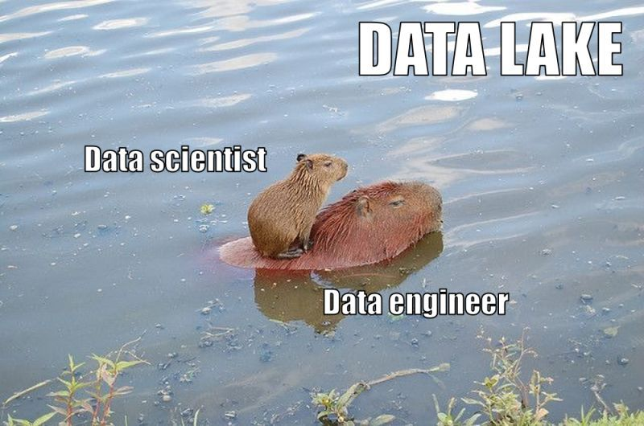

# Journal — 2025-10-11 — DE Day 5

## 1) What I learned (bullets, not prose)
- I learned that there are a LOT of file formats that we may encounter when working with data. 
- I also learned how web scraping works.

## 2) New vocabulary (define in your own words)
- **Pagination** — putting data one batch at a time. Instead of loading it all at once, we split a large dataset into smaller chunks.

## 3) Data Engineering mindset applied (what principles did I use?)
- For our Instacart assignment, I was able to practice building for scalability and performance. 

## 4) Decisions & assumptions (why, alternatives, trade-offs)
- For our Instacart assignment when breaking the raw orders table into 3NF, I decided to create another table for users to ensure that I'm creating a unique list of users. Also, I created a separate table for eval_sets, always taking into consideration the following: insert, update, and delete anomalies.

## 5) Open questions (things I still don’t get)
- I want to futher explore tracking data quality by using tools like dbt tests.

## 6) Next actions (small, doable steps)
- [ ] study dbt tests

## 7) Artifacts & links (code, queries, dashboards)
- Check out [Instacart documentation](https://github.com/df-ftw/instacart_grp6/blob/main/instacart%20documentation/instacart_group6.md)

---

### Mini reflection (3–5 sentences)
I am actually very happy that I am able to understand data engineering concepts one exercise at a time. Now I'm more interested in studying dbt tests and the role they play in Data Quality Lifecycle. 

Also, I now value having good documentation for each project I work on.

### BONUS: What is a meme that best describes what you feel or your learning today?

